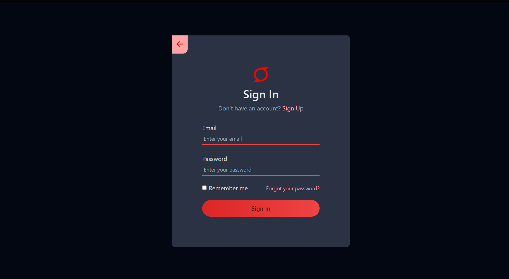

# Login_screen

<h1>Sobre o projeto</h1>

Este projeto foi realizado com o intuito de aprimorar habilidades nas tecnologias HTML e Tailwind CSS. Consta basicamente em uma estilização moderna de um componente login, sendo muito utilizado para sites e aplicações de cadastro de usuários(as).

<h1>Como funciona</h1>

De forma básica e resumida, uma tela de login requer que o(a) usuário(a) coloque seu email e uma senha para entrada da aplicação. A tela de login deste projeto baseia-se no caso de que o(a) usuário(a) já possua realizado um cadastro anterior. Nesta aplicação, foram utilizados ícones coletados do site Fontawesome, uso da linguagem de marcação HTML e, para estilização, foi utilizado um Framework CSS chamado Tailwind CSS

<h2>Tecnologias utilizadas para o desenvolvimento do projeto</h2>

   &nbsp;
  

